# Chess League

## Taula de continguts

- [Chess League](#chess-league)
  - [Taula de continguts](#taula-de-continguts)
  - [Integrants del projecte](#integrants-del-projecte)
  - [Introducció i objectius](#introducció-i-objectius)
    - [**Descripció general**](#descripció-general)
    - [**Motivació a fer el projecte**](#motivació-a-fer-el-projecte)
    - [**Finalitats del projecte**](#finalitats-del-projecte)
    - [**Alternatives a la construcció**](#alternatives-a-la-construcció)
    - [**Tria de llenguatges de programació i SGBD**](#tria-de-llenguatges-de-programació-i-sgbd)
  - [Preparació del projecte](#preparació-del-projecte)
    - [**Anàlisi, disseny i construcció del projecte**](#anàlisi-disseny-i-construcció-del-projecte)
    - [**Fases**](#fases)
    - [**Temporització**](#temporització)
    - [**Diagrama de Gantt**](#diagrama-de-gantt)
    - [**Planificació i seguiment**](#planificació-i-seguiment)
  - [Aspectes tècnics](#aspectes-tècnics)
    - [**Requeriments**](#requeriments)
    - [**Àmbit i camp del projecte**](#àmbit-i-camp-del-projecte)
    - [**Requeriments no funcionals**](#requeriments-no-funcionals)
    - [**Diagrames de casos d'ús**](#diagrames-de-casos-dús)
    - [**Fitxes de casos d'ús**](#fitxes-de-casos-dús)
    - [**Diagrames d'activitat**](#diagrames-dactivitat)
    - [**Diagrama de classes**](#diagrama-de-classes)
      - [**Diagrama de "Cartes"**](#diagrama-de-cartes)
      - [**Diagrama de "Tauler"**](#diagrama-de-tauler)
      - [**Diagrama de "Menus"**](#diagrama-de-menus)
      - [**Diagrama de "Cameres"**](#diagrama-de-cameres)
    - [**Disseny modular del projecte**](#disseny-modular-del-projecte)
    - [**Estructura dels mòduls del projecte**](#estructura-dels-mòduls-del-projecte)
    - [**Estructura de les dades**](#estructura-de-les-dades)
    - [**Model base de dades i correlació**](#model-base-de-dades-i-correlació)
    - [**Descripció de les interfícies i l'UI**](#descripció-de-les-interfícies-i-lui)
    - [**Seguretat en les dades**](#seguretat-en-les-dades)
    - [**Còpies de seguretat**](#còpies-de-seguretat)
  - [Errors i problemes durant el desenvolupament](#errors-i-problemes-durant-el-desenvolupament)
  - [En línia](#en-línia)
  - [Mecàniques del joc](#mecàniques-del-joc)
    - [**Cartes**](#cartes)
    - [**Regles**](#regles)
  - [Seguiment diari](#seguiment-diari)
  - [Conclusions](#conclusions)
  - [Bibliografia](#bibliografia)
  - [Comentari Personal](#comentari-personal)

---

## Integrants del projecte

- Eduardo Morell Muniz
- Sergi Díaz Leiva

## Introducció i objectius

### **Descripció general**

Joc d'escacs en línia (Jugador *vs.* Jugador) amb un sistema de cartes per a fer-ho més divertit i entretingut. El projecte s'ha desenvolupat amb el motor de videojocs Unity.

### **Motivació a fer el projecte**

Eduardo Morell:
> El meu desenvolupament personal com a programador i la meva passió per aquesta professió m'ha portat a fer aquest projecte. El fet de poder crear un videojoc i poder-lo compartir amb altres persones és una cosa que m'apassiona i m'encanta.

Sergi Díaz:
> Poder crear un joc d'Android que sigui completament en línia, que sigui funcional i poder fer-lo en un temps de producció curt és un repte que m'agradaria aconseguir.

### **Finalitats del projecte**

- Aprendre a desenvolupar un videojoc.
- Agafar un joc de taula i portar-lo a un videojoc amb Unity.
- Fer modificacions i afegir funcionalitats.
- Aprendre a incorporar funcionalitats en línia.
- Manejar la comunicació entre clients i servidor.
- Creació i adaptació de la base de dades.
- Creació i adaptació d'una API.
- Aprendre a plasmar un disseny i idea en un projecte real.
- Fer un disseny modular i escalable.
- Planificar i seguir el projecte.

### **Alternatives a la construcció**

Aquestes són les alternatives que s'ha considerat per a la construcció del projecte:

- Motor de gràfic: **Unity**, Godot, Unreal Engine.
- Sistema de BDD: **MongoDB Realms**, MySQL, SQLite, Firebase, MongoDB.

### **Tria de llenguatges de programació i SGBD**

Llenguatge de programació: **C#.** És el llenguatge de programació de Unity. És un llenguatge orientat a objectes molt potent i flexible que ens ofereix moltes possibilitats a l'hora de desenvolupar el projecte.

EL SGBD que s'ha utilitzat és **MongoDB Realms**. És un SGBD derivat del MongoDB molt flexible i escalable per a aplicacions en línia. És molt fàcil d'usar i té una interfície molt intuïtiva.

---

## Preparació del projecte

### **Anàlisi, disseny i construcció del projecte**

El primer pas va ser realitzar una versió del joc d'escacs (sense cap funcionalitat en línia) per consola. Aquesta versió ens va servir per poder establir les bases del projecte i tenir un disseny de la lògica del joc i de les classes que s'usarien.

Un cop teníem el disseny de la lògica del joc, vam adaptar el disseny a Unity. Vam crear les classes i els scripts necessaris per a poder fer el joc. Aquesta part va ser la més llarga i complicada, ja que vam haver de fer molts canvis i adaptacions per a poder fer el joc. Com no teníem molta experiència amb Unity, vam haver de fer moltes proves i cercar molta informació per a poder fer les diferents funcionalitats.

Al mateix temps, vam començar a fer la part en línia. Això inclou la cerca de diferents SGBD, trobar el sistema més òptim per al nostre cas i que ens permetés fer el que volíem. Vam fer proves amb diferents SGBD i finalment vam decidir fer servir MongoDB Realms. Aquest SGBD ens permet complir amb els requisits del projecte i és relativament fàcil d'emprar.

Per al poc temps disponible, vam decidir fer un disseny molt simple i bàsic. Això ens va permetre tenir un disseny molt escalable i modular. Així, si en un futur volem afegir més funcionalitats, serà molt més fàcil i ràpid. Moltes de les decisions del disseny es van prendre en funció del temps que teníem disponible. Per exemple, vam decidir no fer un sistema de inici de sessió i registre perquè no teníem temps suficient per a fer-ho.

El disseny del projecte el vàrem realitzar a mesura que anàvem fent el mateix, ja que, en fer servir una tecnologia que no domina'm i intentar incloure funcionalitat que no havíem fet mai, era molt difícil saber com fer-ho i quines classes i scripts necessitàvem.

### **Fases**

El desenvolupament del projecte es pot dividir en 5 fases:

1. **Fase de disseny i planificació.** En aquesta fase es va fer el disseny de la lògica del joc i es va planificar el projecte. Es va fer un diagrama de Gantt i un seguiment diari del projecte.
2. **Fase de desenvolupament del joc.** En aquesta fase es va desenvolupar el joc. Es va crear el tauler, les peces, els scripts de moviment, etc.
3. **Fase de desenvolupament en línia.** En aquesta fase es va desenvolupar la part en línia. Es va crear la base de dades, l'API i els scripts de comunicació entre el client i el servidor.
4. **Fase de test i correcció d'errors.** En aquesta fase es va fer la correcció d'errors i es va fer el test del joc.
5. **Fase de documentació.** En aquesta fase es va fer la documentació del projecte. Incloent el pla d'empresa, la memòria i la presentació.

### **Temporització**

Aquesta temporització representa el temps real de desenvolupament.

La fase 1 es va realitzar durant les primeres dues setmanes del projecte.

Les fases 2, 3 i 4 s'han fet de forma simultània durant la llargària del projecte. Ja que anàvem fent el joc i la part en línia al mateix temps, duent a terme proves i correccions de forma simultània.

La Fase 5 s'ha fet durant les últimes dues setmanes del projecte. S'ha portat a cap de forma simultània amb la fase 4.

És una descripció un poc generalitzada, ja que, com s'ha comentat anteriorment, les fases 2, 3 i 4 s'han realitzat de forma simultània degut a la nostra inexpertesa amb Unity i MongoDB Realms. I em botat d'un apartat a l'altre sense realment dur un control d'aquests canvis.

### **Diagrama de Gantt**

Els diferents apartats mencionats anteriorment en [les fases del projecte](#fases) es poden veure reflectits de manera desglosada en el diagrama de Gantt. Aquest diagrama ens mostra la planificació del projecte i el temps teoric (calculat inicial) que s'hauria d'haver dedicat a cada apartat.

| Chess League | | | | | | | | | | | | | |
|------------------------------------|----------------|---|---|---|---|---|---|---|---|---|----|----|----|
| Planifiació inicial | | | | | | | | | | | | | |
| ACTIVITAT | INICI DEL PLAN | | | | | | | | | | | | |
| SETMANES | | 1 | 2 | 3 | 4 | 5 | 6 | 7 | 8 | 9 | 10 | 11 | 12 |
| Planifiació inicial | 1 | X | | | | | | | | | | | |
| Funcionalitat Basica Escacs | 1 | X | X | X | | | | | | | | | |
| Cerca d'Informació Jocs Online | 1 | X | X | X | | | | | | | | | |
| Implementació Online + F. Bàsica | 4 | | | | X | X | X | | | | | | |
| Disseny GUI | 6 | | | | | | X | | | | | | |
| Implementació GUI | 7 | | | | | | | X | X | | | | |
| Disseny BDD | 6 | | | | | | X | | | | | | |
| Implementació BDD en Cloud | 7 | | | | | | | X | X | | | | |
| Connexió BDD amb Joc | 8 | | | | | | | | X | X | | | |
| Funcionalitats Especials | 8 | | | | | | | | X | X | X | | |
| Documentació i Testing | 1 | X | X | X | X | X | X | X | X | X | X | X | X |
| Desplegament App | 9 | | | | | | | | | X | X | | |
| Actualitzacions | 11 | | | | | | | | | | | X | X |

### **Planificació i seguiment**

La planificació del projecte es va fer amb un diagrama de Gantt ([Apartat anterior](#diagrama-de-gantt)) i el seguiment es va fer amb apunts diaris a un document de Google Docs.

---

## Aspectes tècnics

### **Requeriments**

- Per a la instal·lació i execució del projecte:
- Unity 2021.3.4f1
- Visual Studio 2022

### **Àmbit i camp del projecte**

L'àmbit del projecte és l'entreteniment i el camp és el dels jocs d'estratègia.

### **Requeriments no funcionals**

- Dispositiu mòbil amb Android 4.4 o superior.
- Connexió a internet.
- Dos jugadors per partida.

### **Diagrames de casos d'ús**

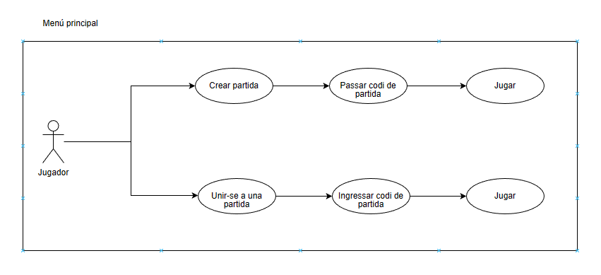
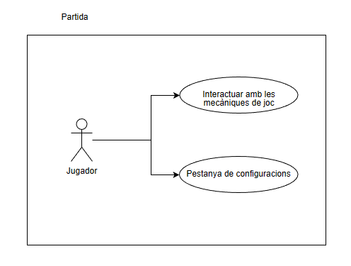

### **Fitxes de casos d'ús**

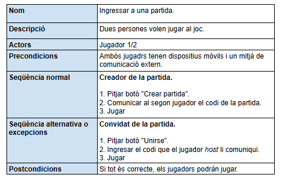

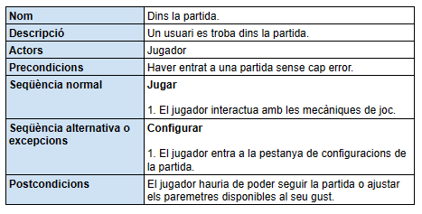

### **Diagrames d'activitat**

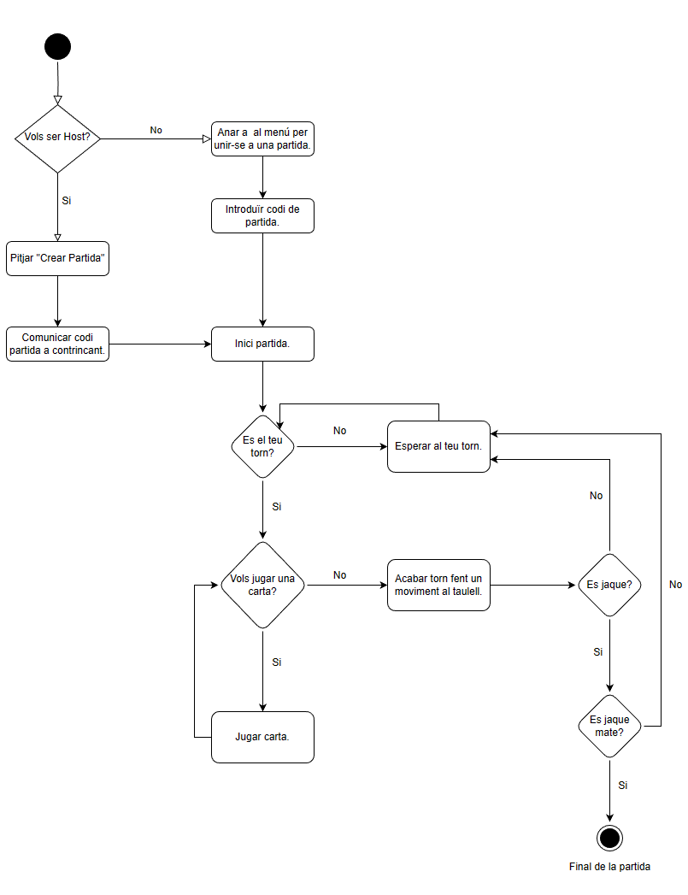

### **Diagrama de classes**

#### **Diagrama de "Cartes"**

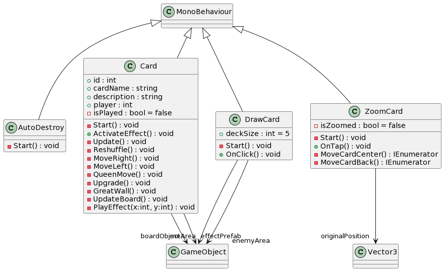

#### **Diagrama de "Tauler"**

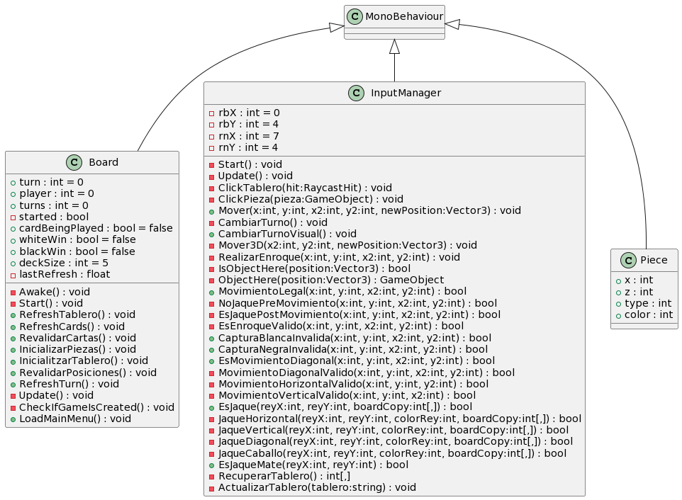

#### **Diagrama de "Menus"**

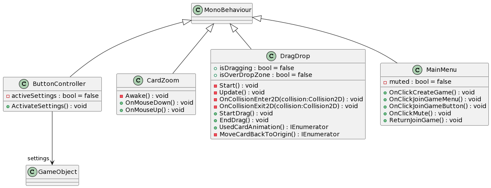

#### **Diagrama de "Cameres"**

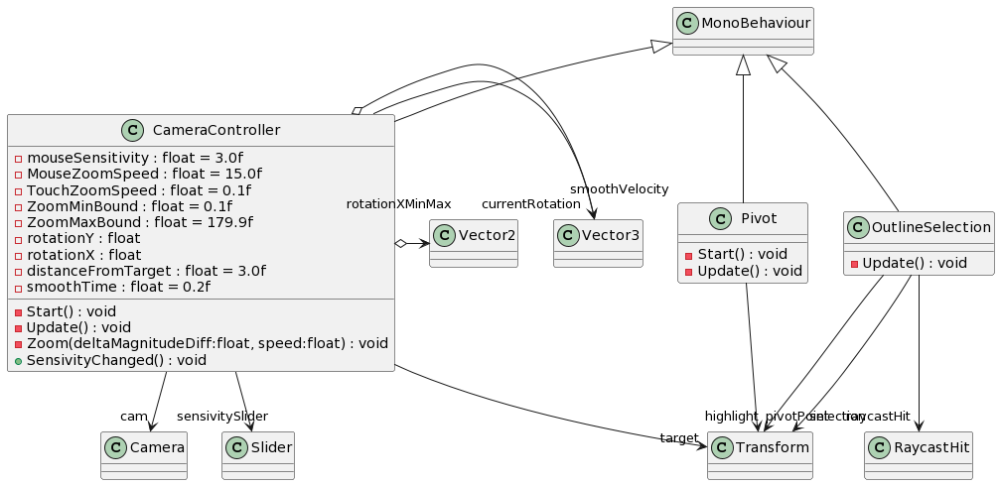

### **Disseny modular del projecte**

Per obtenir un disseny modular, s'ha fet servir diferents *GameObjects* per a cada element del joc. Aquests *GameObjects* s'especifiquen en el següent apartat.

### **Estructura dels mòduls del projecte**

Al Menú principal podem veure els següents elements:

- `MenuController`: Controlador del menú principal. 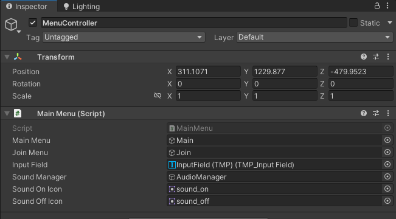
- `AudioManager`: Controlador de l'àudio. 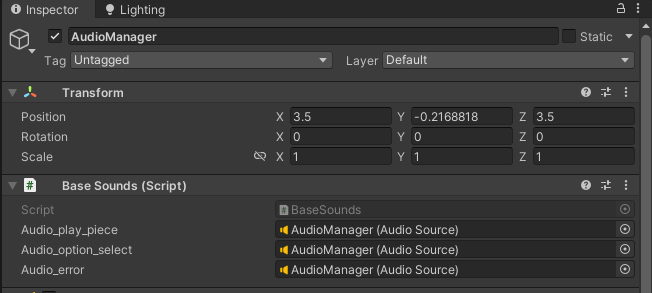

En la partida podem veure els següents elements:

- `Board`: Tauler de joc.
  - `Board`: Controlador del tauler de joc.
    - 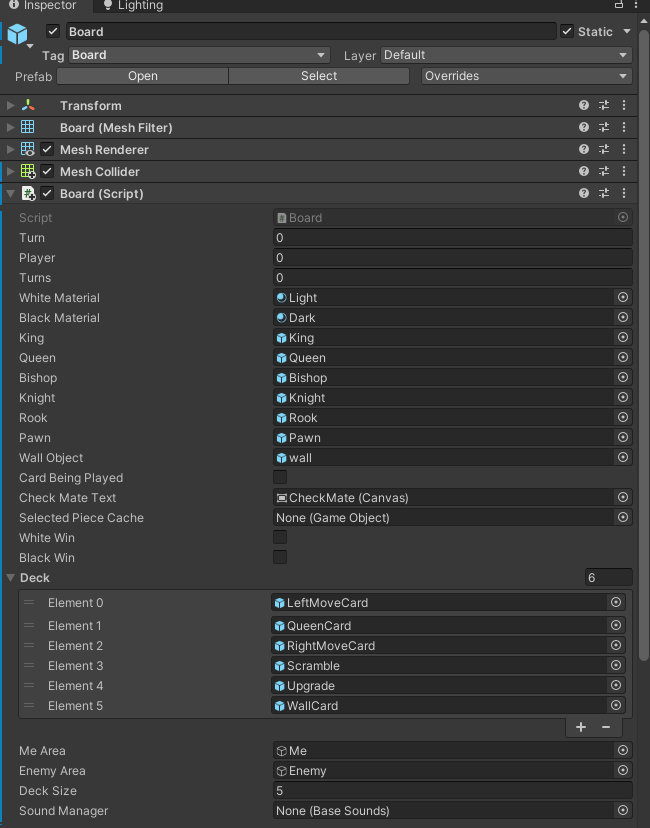
  - `InputManager`: Controlador de les entrades de l'usuari.
    - 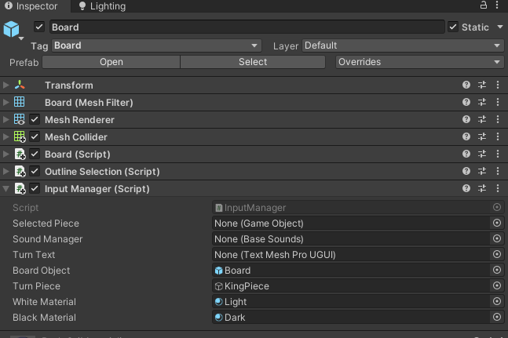
- `Camera`: Càmera de joc. 
  - 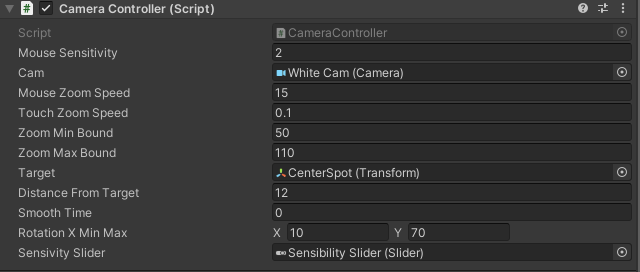
- `RealmControllerManager`: Controlador de la base de dades i les connexions en linea. 
  - 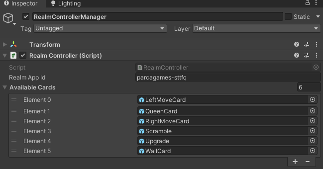

Amb aquests elements i els seus *scripts* s'ha aconseguit un disseny modular del projecte.

### **Estructura de les dades**

Les dades del projecte es guarden en una base de dades no relacional, MongoDB Realms. Aquesta base de dades està formada per dues col·leccions, una per a les partides informacions de les partides i una altra per els estats de les partides (taulers, cartes, etc.). Aquestes dues col·leccions estan relacionades a través de la Id de la partida.

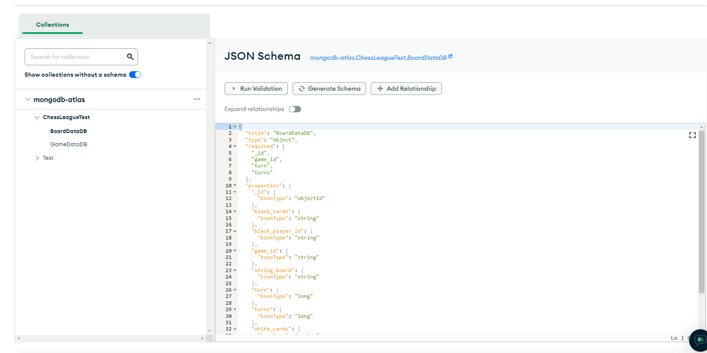
**Exemple:**

Game Data

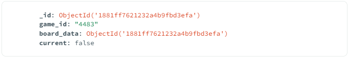

Board Data

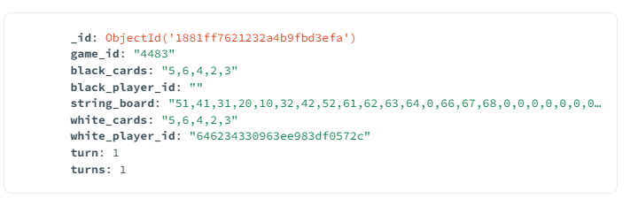

### **Model base de dades i correlació**

- Base de dades no relacional, correlacionades a través de camps com la Id del jugador i la Id de la partida.

### **Descripció de les interfícies i l'UI**

En el menú principal podem veure els següents elements:

- **Botó Jugar**: Inicia una partida.
- **Botó Sortir**: Tanca l'aplicació.

Per limitacions de temps, de moment només hi ha una pantalla de joc, però en un futur es podria afegir una pantalla de configuració, una pantalla de selecció de peces, taulers, dissenys de cartes, etc.

En la pantalla de joc podem veure els següents elements:

- **Tauler**: És el tauler de joc, on es desenvolupa la partida.
- **Cartes (Inferior)**: Són les cartes que té el jugador per a utilitzar durant la partida.
- **Cartes (Superior)**: Són les cartes que té el contrincant per a usar durant la partida.
- **Peça Rei (A dalt-Esquerra)**: És la peça que representa el rei del jugador. Indica el torn actual.

Per a la creació de la interfície s'ha fet ús del sistema d'UI de Unity. Aquest sistema permet crear interfícies de forma visual i molt intuïtiva.

Els jugadors interactuen amb l'interfície a través de la pantalla tàctil del dispositiu mòbil. Aquesta interacció es fa a través d'un conjunt de classes i sistemes.

- 'InputManager': Classe que gestiona l'entrada de l'usuari, detecta, comprova i realitza els moviments de les peces. Primer es selecciona una peça i després es selecciona una casella per a moure-la. Si el moviment és vàlid, es fa. Si no, res.
- 'EventTrigger': El component 'EventTrigger' de Unity permet detectar els diferents esdeveniments que es produeixen a l'interfície. Aquest component s'utilitza per a detectar els esdeveniments de 'PointerTap', 'BeginDrag' i 'EndDrag' de les cartes. Aquests esdeveniments s'fan servir per a detectar quan l'usuari toca una carta, comença a moure-la i la deixa anar. Si toca la carta, es fa més gran i es mostra la informació de la carta. Si l'arrossega al centre de la pantalla, s'activa el seu efecte. Si la deixa anar en un altre lloc, torna a la seva posició original.

### **Seguretat en les dades**

- Pensaments diversos durant el desenvolupament del joc per evitar modificacions externes
- Modificació permisos i triggers al Mongo Atlas per evitar accés i connexions no permeses, l'usuari només pot modificar dades externes a través del api, i algunes pròpies com les monedes del jugador tenen un trigger a la base de dades, que ho limita.

### **Còpies de seguretat**

- Copies de seguretat del projecte de unity cada cert temps per evitar algun bug que fes que no funcioni el joc a nivell de compliació o d'arxius interns del joc.

- No tenim copia de seguretat de la base de dades, tot i que la schema i la conexió estan respaldades en cas de que es borres o deixès de funcionar la base de dades. I ara mateix l'ús important de la base de dades es servir de pont per a jugar la partida online i les dades que hi siguin allà encara no s'utilitzen per res, a futur servirien per fer estadistiques del jugador, historial, etc.

## Errors i problemes durant el desenvolupament

Hem tingut algunes dificultats al llarg del desenvolupament del projecte, algunes d'elles són:

- Fer una lógica robusta i que funcioni correctament.
- Traslladar la lógica del joc a la representació gràfica en Unity.
- Dissenyar el integrar el sistema de cartes amb la lógica d'escacs.
- Implementar aquest sistema. El poder interactuar amb les cartes i que aquestes tinguin efectes sobre la partida.
- Dissenyar i implementar el sistema de joc en línia.
- Dissenyar i implementar el sistema de base de dades.
- Fer el seguiment del projecte i la documentació, ja que l'apartat tècnic del projecte ha estat molt extens i ens ha consumit moltes hores.

---

## En línia

Fem servir el sistema de MongoDB Realms per a gestionar la base de dades i el mitjà per el qual els jugadors es poden connectar entre ells.

MongoDB Realms ens proporciona un `package` per el qual podem interactuar amb la seva API. Crear l'objecte amb l'informació de la partida, jugador, etc. I crear o modificar metodes per a interactuar amb la base de dades. Ja sigui per a crear una partida, un jugador, o per a actualitzar la informació de la partida.

Gràcies a aquesta API podem fer que els jugadors es puguin connectar entre ells i jugar una partida en línia. Enviant, rebent i comprovant la informació que tenen els jugadors en local amb la que hi ha a la base de dades.

Per exemple: Per detectar que un torn s'ha jugat, tenim una variable `turns`, que és un comptador dels torns. Cada 3 segons, comprovem si el valor de la variable `turns` de la base de dades és major a la que tenim en local. Si és diferent, vol dir que el contrincant ha jugat un torn i nosaltres no, per tant, actualitzem la informació de la partida en local, obtenint l'estat del tauler, les cartes i el torn actual.

---

## Mecàniques del joc

El joc es pot dividir en dues parts, la part dels escacs, i la part de les cartes. A continuació es descriuen les mecàniques de cada part.

- Moviment de les peces. Es manté el moviment de les peces, com en els escacs normals.
- Cartes de joc. Les cartes permeten al jugador fer accions que no es poden fer en els escacs normals, no sols relacionat amb moviments de les peces sinó que també es poden portar a cap modificacions en el taulell per la resta de la partida com pot ser la carta "Gran Muro" (s'expliquen les cartes disponibles més endavant) que permet posar un mur en el taulell que impedeixi el pas de les peces.

### **Cartes**

Les cartes que, de moment, es poden trobar en el joc són les següents:

- **Gran Muro**: Aquesta carta permet posar un mur en el taulell, que impedeixi el pas de les peces. El posicionament del mur és aleatori en una casella buida del taulell.
- **A un lado**: Mou totes les peces del taulell una posició cap a la dreta.
- **Al otro lado**: Mou totes les peces del taulell una posició cap a l'esquerra.
- **Monarca**: Converteix un peó aleatori en reina.
- **Reposición**: Reposiciona totes les peces del taulell. Mantenint les posicions originals de les peces.
- **Ascenso**: Converteix un peó aleatori en torre, alfil o cavall.

El disseny de les cartesha estat condicionat per el temps i la dificultat per implementar funcionaments més complexes. En cas de seguir el desenvolupament del joc, es revisaria el disseny de les cartes per aconseguir un joc més equilibrat i divertit.

### **Regles**

Les regles del joc són les següents:

1. Un jugador guanya quan el rei del contrincant és capturat.
2. Els jugadors es mouen alternativament, com en els escacs normals. (A no ser que una carta ho impedeixi)
3. Es fa una selecció aleatòria del color de les peces de cada jugador.
4. Cada jugador comença amb 5 cartes. No s'obtindran més cartes durant la partida.
5. En el seu torn, un jugador pot fer servir totes les cartes que vulgui, quan mou una peça, s'acabarà el seu torn.
   - El motiu per aquesta decisió és que els jugadors tinguin més llibertat a l'hora de jugar, i puguin fer estratègies més complexes. Però ja que no es poden aconseguir més cartes durant la partida, els jugadors han de pensar molt bé quan fer servir les cartes, perquè si les fan servir totes al principi, no tindran cap carta per a fer servir durant la partida.
6. Es fa una selecció aleatòria de les cartes. Els jugadors juguen amb les mateixes cartes i saben quines cartes té el contrincant.
    - El motiu que els jugadors tinguin les mateixes cartes és perquè el joc sigui més equilibrat. Els escacs ja són un joc molt equilibrat, i amb les cartes, es poden fer moltes estratègies, però si cada jugador té cartes diferents, pot ser que un jugador tingui cartes molt millors que l'altre, i això desequilibraria el joc i aniria en contra de l'essència dels escacs, que en tot moment sabem quines peces té el contrincant i quins moviments pot fer. L'afegiment de les cartes és per a fer el joc més divertit, i perquè els jugadors puguin fer estratègies diferents, però mantenint aquesta essència.
7. Cada jugador té 5 minuts per a jugar la partida. Si un jugador es queda sense temps, perd la partida.

---

## Seguiment diari

En aquest seguiment no s'han inclòs les hores dedicades a la documentació, ja que aquesta s'ha anat realitzant al llarg del projecte, i no s'ha dedicat un temps específic a ella. Així doncs, aquest seguiment només inclou les hores dedicades al desenvolupament del joc i aspectes tècnics relacionats amb el projecte.

|            | **EDUARDO**                                                                            | **SERGI**                                                                                    |
|------------|----------------------------------------------------------------------------------------|----------------------------------------------------------------------------------------------|
| 02/03/2023 | Inici del desenvolupament de la heurística del joc 2d (consola).                       | Desenvolupament heurístic de la llar a la consola                                            |
| 03/03/2023 | Acabat lògic en joc 2D.                                                                | Acabat lògic en el joc 2D (consola).                                                         |
| 09/03/2023 | Programació de jocs a la consola, implementant torns i jaques                          | Programació de jocs a la consola, implementant torns i jaques                                |
| 10/03/2023 | Joc a la consola semiterminada                                                         | Joc a la consola semiterminada                                                               |
| 16/03/2023 | El darrer joc de detalls a la consola                                                  | El darrer joc de detalls a la consola                                                        |
| 23/03/2023 | Proves de consola.                                                                     | Joc a la consola funcional                                                                   |
| 24/03/2023 | Inici del desenvolupament en la cerca de la unitat i la informació                     | Pla de negocis                                                                               |
| 30/03/2023 | Desenvolupament en unitat. Implementació del sistema d'entrada                         | Pla de negocis                                                                               |
| 31/03/2023 | Desenvolupament en unitat. Proves amb el sistema d’entrada                             | Pla de negocis                                                                               |
| 13/04/2023 | Desenvolupament en unitat. Implementació de la lògica del joc a la consola de gràfics. | Cerqueu l'operació en línia                                                                  |
| 14/04/2023 | Desenvolupament en unitat. Desenvolupament de la lògica del joc.                       | Primers intents en línia, provant el riptide del codi net, etc.                              |
| 20/04/2023 | Desenvolupament en unitat. Desenvolupament de la lògica del joc.                       | Buscant altres maneres de fer en línia                                                       |
| 21/04/2023 | Desenvolupament en unitat. Desenvolupament de la lògica del joc.                       | Prova Unity Mongo DB Realms                                                                  |
| 02/05/2023 | Cerca d'informació i implementació d'un sistema de targeta inicial.                    | Realms de MongoDB                                                                            |
| 03/05/2023 | Desenvolupament del sistema de targetes.                                               | Prova en instància antiga del joc d’implementació de la línia                                |
| 04/05/2023 | Desenvolupament del sistema de targetes.                                               | MongoDB Realms Semi Running Online (codificat dur)                                           |
| 05/05/2023 | Desenvolupament del sistema de targetes.                                               | Els regnes de MongoDB treballen perfectament entre 2 dispositius                             |
| 08/05/2023 | Implementació del sistema en línia amb l'estat actual del desenvolupament del joc.     | Primer intent de implementació de MongoDB Realms al joc a l'estat actual                     |
| 09/05/2023 | Proves, ajustaments i canvis en relació amb la connectivitat del joc.                  | Implementació de la nova configuració de bases de dades de l'esquema I als regnes de MongoDB |
| 10/05/2023 | Proves, ajustaments i canvis en relació amb la connectivitat del joc.                  | MongoDB Realms treballant al joc (codificat dur)                                             |
| 11/05/2023 | Revisió del sistema de targetes en relació amb el sistema en línia.                    | Mètode de generació de Realms MongoDB Eliminació de codis durs                               |
| 12/05/2023 | Creació d'un sistema "unit".                                                           | Connecteu els elements i corregiu els errors de connexió entre dispositius                   |
| 13/05/2023 | Proves amb el sistema de creació/cerca.                                                | El darrer detall de la reproducció, una mica de música per evitar errors, etc.               |
| 14/05/2023 | Revisió dels menús, ajustaments i sistemes que interactuen amb el jugador.             | Pla de negocis                                                                               |
| 15/05/2023 | Revisió de jocs i funcionalitats mecànics.                                             | Ressenyes finals i prepareu l'exposició                                                      |

---

## Conclusions

Al llarg del desenvolupament del projecte tant en Sergi com jo hem après moltes coses, tant de Unity com de MongoDB, i hem pogut veure com és el desenvolupament d'un projecte de programació en grup, em pogut veure les dificultats que comporta, i com s'han de solucionar.

Hem tingut manetjar el temps i l'esforç que hem dedicat a les diferents parts del projecte, seber quan dedicar més temps a una part i quan a una altra, i com hem de distribuir el temps per a que el projecte estigui acabat a temps. Per desgracia no hem pogut realitzar tot el que voliem, ni impementar les mecàniques que havíem envisionat, però hem intentat fer el màxim possible.

Tot i així, estem molt contents amb el resultat. D'haver tingut l'oportunitat d'aprendre i aplicar nous coneixements. I d'haver pogut realitzar un projecte que ens agrada.

---

## Bibliografia

- **Unity Manual**: la documentació oficial de Unity, que cobreix tots els aspectes del desenvolupament de jocs en Unity. Disponible a [https://docs.unity3d.com/Manual/index.html](https://docs.unity3d.com/Manual/index.html)
- **StackOverflow**: un lloc web de preguntes i respostes sobre programació, que pot ser útil per a resoldre problemes específics en el desenvolupament del projecte. Disponible a [https://stackoverflow.com/](https://stackoverflow.com/)
- **Unity Answers**: un lloc web de preguntes i respostes sobre programació en Unity, que pot ser útil per a resoldre problemes específics en el desenvolupament del projecte. Disponible a [https://answers.unity.com/index.html](https://answers.unity.com/index.html)
- **Brackeys**: Youtuber que fa tutorials de Unity. Disponible a [https://www.youtube.com/channel/UCYbK_tjZ2OrIZFBvU6CCMiA](https://www.youtube.com/channel/UCYbK_tjZ2OrIZFBvU6CCMiA)
- **MongoDB Manual**: la documentació oficial de MongoDB, que cobreix tots els aspectes de la base de dades MongoDB. Disponible a [https://docs.mongodb.com/manual/](https://docs.mongodb.com/manual/)
- **MongoDb Realm Docs**: la documentació oficial per a treballar amb MongoDB Realms, que explica com interactuar desde alguna app amb la base de dades, trigger, endpoints i com fer les sincronitzacions realmtime. Disponible a [https://www.mongodb.com/docs/realm/](https://www.mongodb.com/docs/realm/)

---

## Comentari Personal

Dur a terme aquest projecte ha estat una experiència molt enriquidora, ja que ens ha permès aprendre moltes coses, com per exemple, el funcionament de les bases de dades no relacionals, com el MongoDB, o com fer un joc en línia, amb un servidor propi, i com fer que aquest servidor es comuniqui amb el joc, i aquest amb la base de dades. També ens ha permès millorar els nostres coneixements del motor de videojocs Unity, ja que hem pogut fer un joc quasi complet, amb unes mecàniques molt concretes, i amb unes interfícies molt ben definides.

Tant jo (Eduardo Morell) com el meu company (Sergi Díaz) estem molt satisfets amb el resultat del projecte, perquè a pesar de què no hem pogut completar la visió original, hem pogut fer un joc molt divertit, i que té molt de potencial. Si tinguéssim més temps, podríem acabar-lo, polir-lo i publicar-lo a la plataforma de Google Play Store, per a que tothom pogués jugar-hi.
