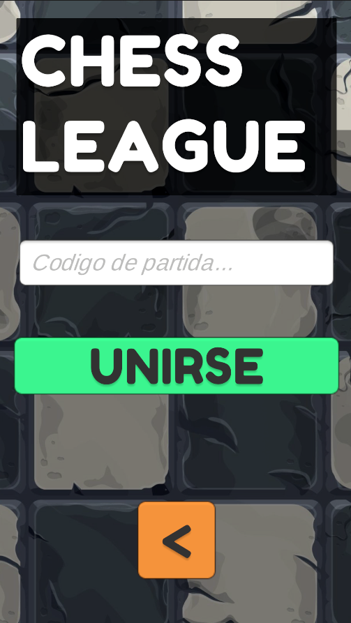
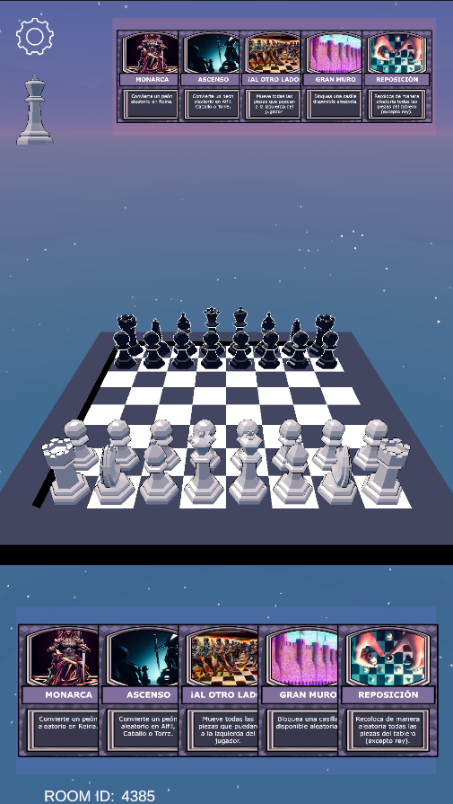
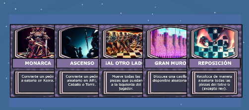

# Manual D'Usuari

- [Manual D'Usuari](#manual-dusuari)
  - [**Introducció**](#introducció)
  - [**Requisits**](#requisits)
  - [**Instal·lació**](#installació)
  - [**Instruccions**](#instruccions)
    - [**Inici**](#inici)
    - [**Partida**](#partida)
      - [**Moviment de peces**](#moviment-de-peces)
      - [**Cartes**](#cartes)
      - [**Camera**](#camera)
      - [**Configuracions**](#configuracions)

## **Introducció**

Manual (o tutorial) d'usuari per al joc `ChessLeague`.

## **Requisits**

- Dispositiu Android 4.4 o superior.
- Connexió a Internet.
- 2 jugadors.
- 1 dispositiu per jugador.

## **Instal·lació**

1. Descarregar l'arxiu `ChessLeague.apk` del repositori.
2. Copiar l'arxiu a la memòria interna del dispositiu Android.
3. Instal·lar l'arxiu des de l'aplicació `Arxius`.
4. Acceptar els permisos necessaris per a l'aplicació.
5. Executar l'aplicació.

## **Instruccions**

### **Inici**

1. En iniciar l'aplicació, es mostrarà la pantalla d'inici.
2. En aquesta pantalla, es pot seleccionar 2 camins:
   1. `Crear Partida`: Crea una partida nova i un codi per a que un altre jugador s'hi pugui unir.
   2. `Unirse a Partida`: Unir-se a una partida existent mitjançant un codi.
      1. Introduir el codi de la partida.
      2. Premre el botó `Unirse`.

### **Partida**

En iniciar la partida, es mostrarà el tauler de joc, amb les peces col·locades en la seva posició inicial, les teves cartes a la part inferior de la pantalla i les cartes de l'adversari a la part superior.

A la part superior esquerre de la pantalla, es mostra el torn actual i un botó per obrir la pestanya de configuracions.

#### **Moviment de peces**

Per moure una peça, cal seleccionar-la i després seleccionar la casella on es vol moure. Si el moviment és vàlid, la peça es mourà a la casella seleccionada. En cas contrari, no es farà res.

Els moviments disponibles per a les peces son els de sempre:

- Peó: 1 casella endavant, 2 caselles endavant (només en el primer moviment), 1 casella en diagonal (per a matar una peça).
- Torre: Totes les caselles en línia recta.
- Cavall: En forma de L.
- Alfil: Totes les caselles en diagonal.
- Reina: Totes les caselles en línia recta i en diagonal.
- Rei: 1 casella en qualsevol direcció.

#### **Cartes**

Les cartes són un element clau del joc. Cada jugador té 5 cartes, les mateixes per a tots els jugadors. Les cartes es poden utilitzar per a fer moviments especials i alterar el fluxe de la partida.

Cada carta te els seus propis efectes, que es descriuen a la part inferior de la mateixa.

Els controls relacionat amb les cartes son els següents:

- *Tap* a una carta: fes zoom per mostrar els efectes de la carta.
- Arrossegar una carta al centre de la pantalla: activa la carta.

#### **Camera**

El jugador pot moure la càmera per a veure el tauler des de diferents angles. Per a fer-ho, cal arrossegar la pantalla en qualsevol direcció.

Tambe es pot fer zoom per a veure el tauler més de prop o més de lluny. Per a fer-ho, cal fer *pinch* amb dos dits i arrossegar-los cap a fora o cap a dins.

#### **Configuracions**

En obrir la pestanya de configuracions, es mostraran les següents opcions:

- `Abandonar Partida`: Abandona la partida actual i torna a la pantalla d'inici.
- `Sensiibilitat Camera`: Modifica la sensibilitat del moviment de la càmera.

